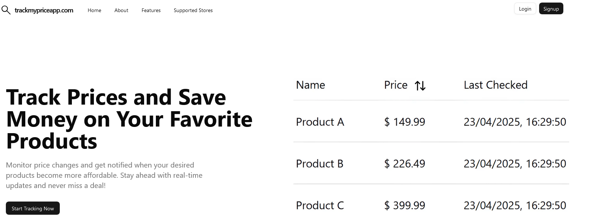

# TrackMyPriceApp

TrackMyPriceApp is a full-stack application that helps users track the price of their favorite products and get notified when prices drop. It currently supports Amazon, Mercado Livre, Magazine Luiza and OLX.

## Features

-   User Authentication using Firebase Auth
-   Add products via URL from supported stores
-   Email notifications when prices drop
-   Dashboard to manage tracked products
-   Responsive Frontend built with Next.js and Tailwind (using ShadCN UI and Shadcnblocks)

## Preview



## Tech Stack

### Frontend

-   Next.js
-   Tailwind CSS
-   ShadCN UI
-   Lucide Icons
-   Firebase Auth

## Backend

The backend for this project is built with NestJS and PostgreSQL. You can find it here:

[Backend Repository](https://github.com/mathiasbelle/trackmypriceapi)

## Running Locally

### Prerequisites

-   Node.js (v18+)
-   Firebase project

### 1. Clone the repository

```bash
git clone https://github.com/mathiasbelle/trackmypriceapp.git
cd pricetracker
```

### 2. Setup the Frontend

```bash
cd frontend
npm install
```

Create a `.env.local` file with your Firebase credentials and the url of the backend api.:

```env
NEXT_PUBLIC_FIREBASE_API_KEY=...
NEXT_PUBLIC_FIREBASE_AUTH_DOMAIN=...
NEXT_PUBLIC_PROJECT_ID=...
NEXT_PUBLIC_STORAGE_BUCKET=...
NEXT_PUBLIC_MESSAGING_SENDER_ID=...
NEXT_PUBLIC_APP_ID=...
NEXT_PUBLIC_BASE_URL=the base url of the backend api
```

Then run:

```bash
npm run dev
```
